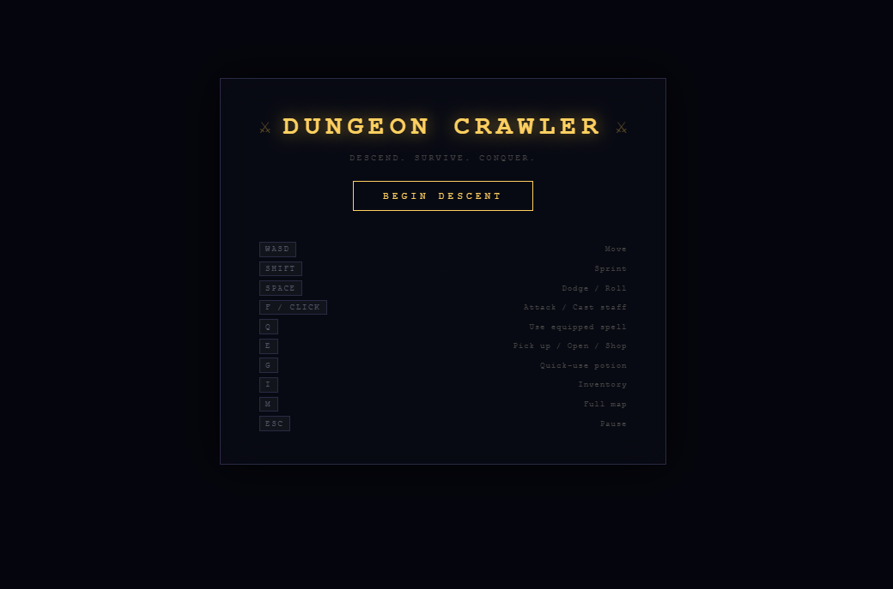
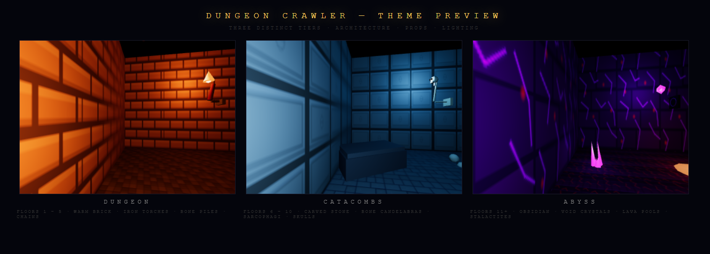
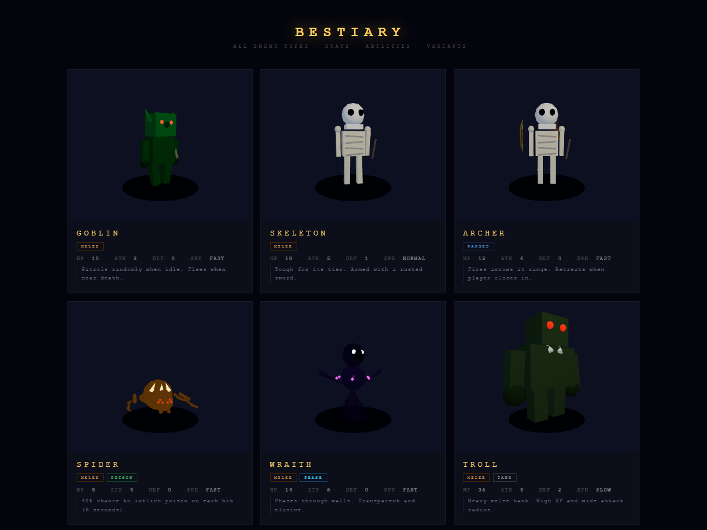
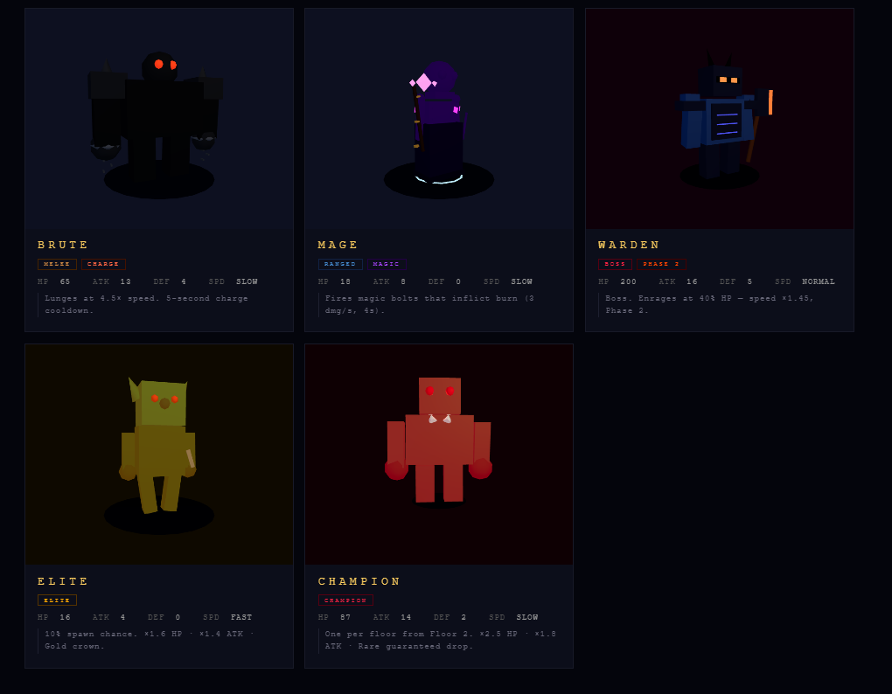
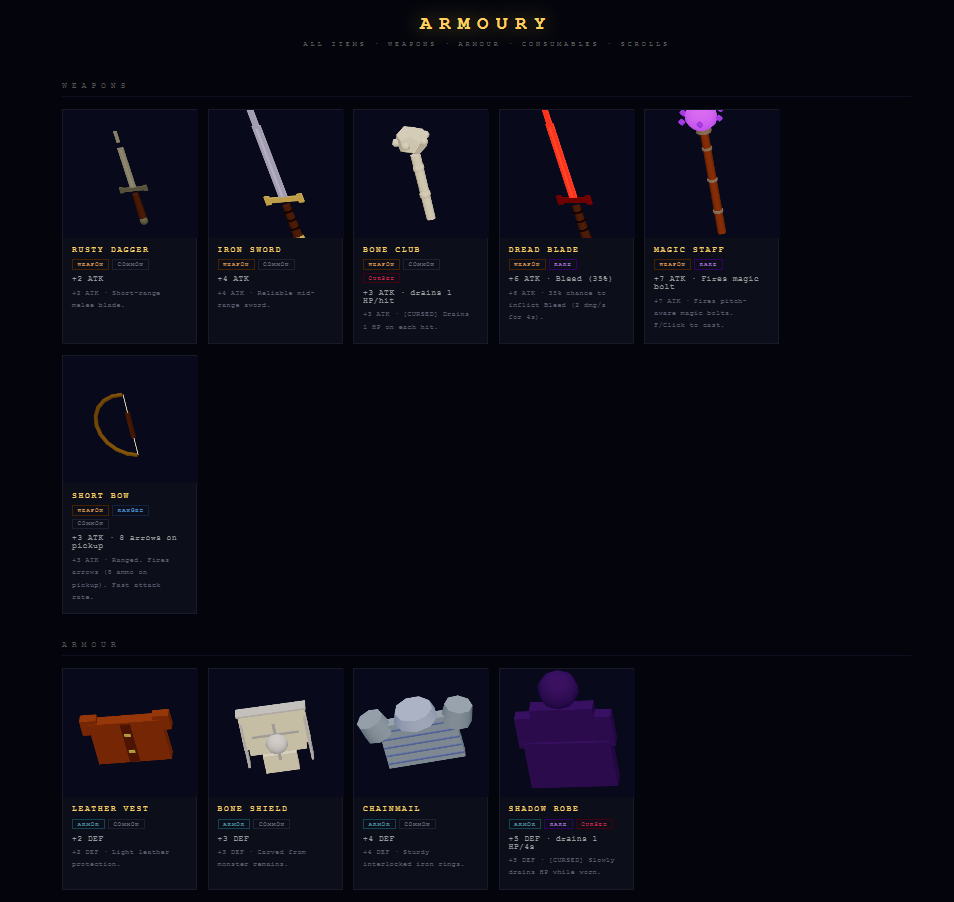
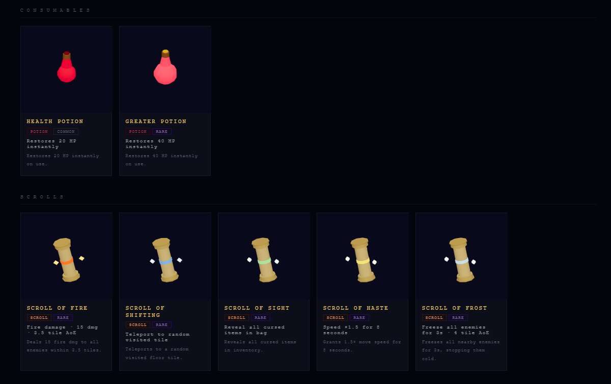
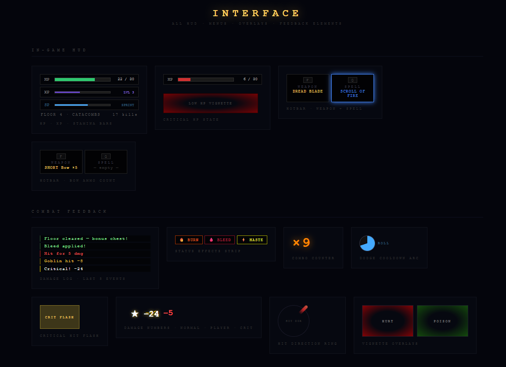
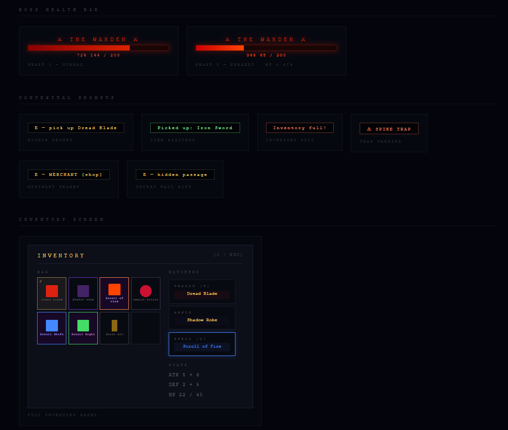
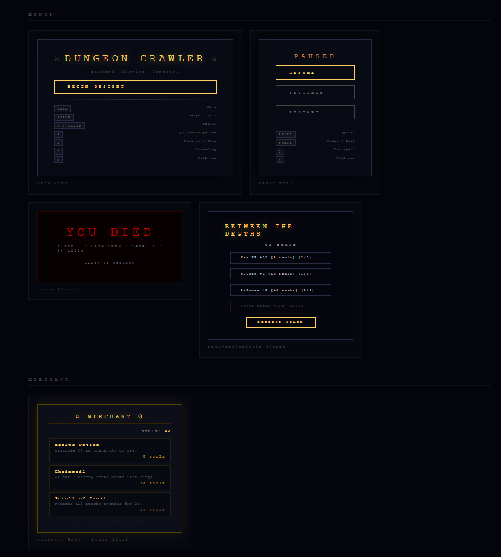
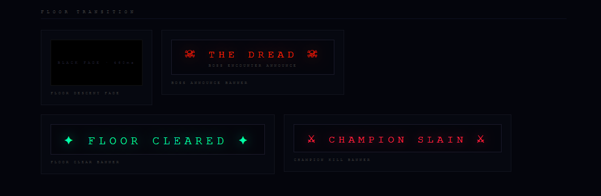

# DUNGEON CRAWLER

> **Descend. Survive. Conquer.**

A first-person 3D dungeon crawler built entirely in the browser — no build step, no bundler, no install. Pure ES modules, Three.js from CDN, and procedural Web Audio.

---

## Screenshots

<table>
<tr>
<td align="center" width="50%">

<sub>Main Menu</sub>
</td>
<td align="center" width="50%">

<sub>Three dungeon themes — Dungeon · Catacombs · Abyss</sub>
</td>
</tr>
<tr>
<td align="center" width="50%">

<sub>Bestiary — Goblin · Skeleton · Archer · Spider · Wraith · Troll</sub>
</td>
<td align="center" width="50%">

<sub>Bestiary — Brute · Mage · Warden Boss · Elite · Champion</sub>
</td>
</tr>
<tr>
<td align="center" width="50%">

<sub>Armoury — Weapons & Armour</sub>
</td>
<td align="center" width="50%">

<sub>Armoury — Consumables & Scrolls</sub>
</td>
</tr>
<tr>
<td align="center" width="50%">

<sub>HUD — Bars · Hotbar · Combat Feedback</sub>
</td>
<td align="center" width="50%">

<sub>Boss Bar · Contextual Prompts · Inventory</sub>
</td>
</tr>
<tr>
<td align="center" width="50%">

<sub>Menus — Main · Pause · Death · Meta-Progression · Merchant</sub>
</td>
<td align="center" width="50%">

<sub>Banners — Floor Transition · Boss · Clear · Champion</sub>
</td>
</tr>
</table>

---

## Features

### Core Gameplay
- First-person 3D exploration with full mouse look and WASD movement
- Procedurally generated dungeons via Binary Space Partitioning (BSP) — unique layout every run
- Fog of war — only explored tiles appear on the map
- Three escalating floor themes: **Dungeon** (floors 1–5) · **Catacombs** (6–10) · **Abyss** (11+)
- Endless descent with increasing enemy difficulty per floor

### Combat
- **Melee** — per-weapon attack range; hit detection with dot-product facing check
- **Ranged** — staff fires pitch-aware 3D bolts; bow fires arrows with ammo management
- **Critical hits** — 12% chance for 2× damage with screen flash and gold damage number
- **Knockback** — both player and enemies are pushed back on hit
- **Dodge/Roll** — `SPACE` with 0.28s invincibility window and 1.8s cooldown
- **Sprint** — `SHIFT` with a 3-second stamina cap; FOV widens dynamically when sprinting
- **Combo counter** — consecutive hits tracked with escalating colour display
- **Kill streak** — Triple Kill / Quad Kill / Rampage banners with haste bonus

### Status Effects
| Effect | Source | Duration |
|---|---|---|
| 🔥 Burn | Mage bolts → player | 3 dmg/s · 4s |
| 🩸 Bleed | Dread Blade → enemy | 2 dmg/s · 4s |
| ⚡ Haste | Scroll / Kill streak | ×1.5 speed · 8s |
| ☠ Poison | Spider → player | 2 dmg/s · 6s |
| ❄ Freeze | Scroll / Staff crit | Immobilised · 2–3s |

### Enemies — 9 Types

| Enemy | HP | ATK | Special |
|---|---|---|---|
| Goblin | 10 | 3 | Patrols in idle |
| Skeleton | 18 | 5 | Armed with sword |
| Archer | 12 | 6 | Ranged · flees at close range |
| Spider | 8 | 4 | 40% poison on hit |
| Wraith | 14 | 5 | Phases through walls |
| Troll | 35 | 8 | High HP tank |
| Brute | 65 | 13 | 4.5× speed lunge charge |
| Mage | 18 | 8 | Ranged magic bolts that burn |
| **Warden** | **200** | **16** | **Boss · Enrages at 40% HP** |

**Variants:** 10% chance for an **Elite** (×1.6 HP, gold crown). One **Champion** per floor from Floor 2 (×2.5 HP, red aura, guaranteed rare drop).

### Items — 17 Total

**Weapons:** Rusty Dagger · Iron Sword · Bone Club *(cursed)* · Dread Blade *(rare, bleeds)* · Magic Staff *(rare, fires bolts)* · Short Bow *(ranged)*

**Armour:** Leather Vest · Bone Shield · Chainmail · Shadow Robe *(cursed, drains HP)*

**Consumables:** Health Potion (+20 HP) · Greater Potion (+40 HP)

**Scrolls** *(equip to spell slot → Q to cast)*: Scroll of Fire · Scroll of Shifting · Scroll of Sight · Scroll of Haste · Scroll of Frost

### Dungeon Features
- **Secret walls** — faintly visible; press `E` to open and reveal rare loot
- **Spike traps** — visible on the minimap; proximity warning shown on approach
- **Barrels** — smash for a 45% chance of loot
- **Merchant** — one room per floor; spend souls on 4 rotating shop items
- **Boss floors** — random interval every 1–5 floors; LOS-based boss reveal
- **Floor clear bonus** — extra loot chest at stairs when all enemies are dead

### Meta-Progression
Souls earned on death (floor × 3 + kills) persist across runs via `localStorage`.

| Upgrade | Cost | Max |
|---|---|---|
| Max HP +10 | 8 souls | 5 levels |
| Attack +1 | 10 souls | 4 levels |
| Defense +1 | 10 souls | 4 levels |
| Dodge Speed +10% | 12 souls | 3 levels |

### HUD & Feedback
- HP · XP · Stamina bars with colour transitions
- Weapon + Spell hotbar with per-scroll colour glow
- Minimap (live) + Full map `M` with fog of war; trap tiles marked in red-brown
- Boss health bar with Phase 2 pulse when below 40%
- Combat log — last 5 events, colour-coded by type
- Floating damage numbers — white crits, red player damage
- Status effect strip (Burn · Bleed · Haste icons)
- Hit direction ring — shows which direction you were hit from
- Low HP vignette + heartbeat audio (below 25%)
- Critical hit gold flash overlay
- Dodge cooldown arc indicator
- Contextual prompts for pickups, merchant, secrets, and traps

### Audio — 100% Procedural
All audio is generated in real-time via the Web Audio API — no sound files required.

- Ambient drone (3 layered oscillators)
- Per-weapon swing sounds (dagger swish · sword clang · club thud · staff hum)
- Footsteps · Dodge rush · Critical ring · Burn hiss · Bleed pulse
- Level-up arpeggio · Floor-clear fanfare · Champion kill impact
- Heartbeat at low HP (frequency increases as HP drops)

---

## Controls

| Key | Action |
|---|---|
| `WASD` | Move |
| `SHIFT` | Sprint |
| `SPACE` | Dodge / Roll |
| `F` / `Click` | Attack / Cast staff |
| `Q` | Use equipped scroll |
| `E` | Pick up · Open secret · Enter shop |
| `G` | Quick-use potion (Greater first) |
| `I` | Inventory |
| `M` | Full floor map |
| `ESC` | Pause |

**Settings** (in pause menu): Mouse sensitivity · Field of view

---

## How to Run

No install required. Just serve the project folder over HTTP.

**Using the included PowerShell script:**
```powershell
./serve.ps1
```
Then open `http://localhost:8080` in any modern browser.

**Or with any static server:**
```bash
npx serve .
# or
python -m http.server 8080
```

> **Note:** The game must be served over HTTP (not opened as `file://`) because ES module imports require a server origin.

---

## Project Structure

```
dungeon-crawler/
├── index.html          # Static shell — all UI elements declared here
├── style.css           # All styling (monospace dark/amber theme)
├── serve.ps1           # One-command local server
│
├── src/
│   ├── main.js         # Game loop, combat, input, all system integration
│   ├── renderer.js     # Three.js renderer, weapon viewmodel, particles, sconces
│   ├── enemies.js      # Enemy AI (A* states), 9 types, elite/champion/boss
│   ├── dungeon.js      # Procedural BSP dungeon generation
│   ├── pathfinding.js  # A* algorithm + line-of-sight (hasLOS)
│   ├── inventory.js    # Inventory UI, equip system, scroll slot
│   ├── weapons.js      # Ground pickup meshes + first-person viewmodel meshes
│   ├── items.js        # Item catalogue, drop tables, GroundItem class
│   ├── audio.js        # Procedural Web Audio SFX + ambient drone
│   ├── player.js       # Player stats (HP, XP, level, attack, defense)
│   ├── camera.js       # Camera utilities
│   ├── input.js        # Keyboard/mouse input handler
│   ├── world.js        # World grid, tile system, fog of war
│   ├── constants.js    # Tile type constants, map dimensions
│   └── icons.js        # Renders 3D item icons to PNG for inventory
│
└── preview/            # Visual documentation (serve and screenshot)
    ├── index.html      # Navigation hub
    ├── themes.html     # Three dungeon environments in 3D
    ├── enemies.html    # Animated bestiary — all 9 enemy types
    ├── items.html      # All 17 items with rotating 3D meshes
    └── ui.html         # Complete interface reference
```

---

## Tech Stack

| | |
|---|---|
| **Renderer** | [Three.js](https://threejs.org/) r164 — loaded from CDN, no bundler |
| **Audio** | Web Audio API — fully procedural, zero sound files |
| **Language** | Vanilla ES2022 modules |
| **Runtime** | Any modern browser (Chrome, Firefox, Edge, Safari) |
| **Dependencies** | Zero npm packages |

---

## Architecture Notes

- **No build step** — ES modules load directly in the browser via `<script type="module">`
- **Instanced rendering** — walls, floors, ceilings use `THREE.InstancedMesh` for GPU efficiency
- **Glow pool** — 10 `PointLight` instances pre-allocated at startup to avoid mid-game shader recompilation hitches
- **Procedural audio** — every sound is synthesised from oscillators and noise buffers; the ambient drone runs three sine oscillators at 41/55/82 Hz
- **A\* pathfinding** — enemies recompute paths every 0.42s; wraith ignores wall collision entirely
- **Meta-progression** — stored in `localStorage` under key `dc_meta_v1`; souls persist across browser sessions

---

## License

MIT — do whatever you want with it.
